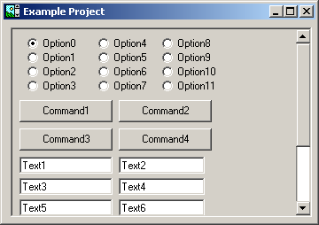



## A simple Scrolling Form \(Not an ActiveX Control\)

### Description

This is a control that will allow you to create a form that can be scrolled by the user. It is very simple to implement.

This submission is heavily based on another submission by Fred_Cpp:

http://www.planet-source-code.com/vb/scripts/showcode.asp?lngWId=1&txtCodeId=31896

I hope that Fred doesn't get mad at me for tweaking his code! :)

My modified version has little changes. When there is no need to scroll horizontally or vertically, the scroll bar is hidden. The scroll bars do not have the annoying blinking anymore. I did a lot of clean up on the code and added a few comments in "English".

I think that the example looks better, too.

It would be good if you guys could give me some feedback.

----

I have just uploaded an ActiveX Control that is much better. The URL Is:

----

http://www.planet-source-code.com/vb/default.asp?lngCId=32374&lngWId=1
 
### More Info
 

             |
---                |---
**Submitted On**   |2002-02-26 19:35:04
**By**             |[Elias Barbosa](https://github.com/Planet-Source-Code/PSCIndex/blob/master/ByAuthor/elias-barbosa.md)
**Level**          |Intermediate
**User Rating**    |4.5 (50 globes from 11 users)
**Compatibility**  |VB 6\.0
**Category**       |[Custom Controls/ Forms/  Menus](https://github.com/Planet-Source-Code/PSCIndex/blob/master/ByCategory/custom-controls-forms-menus__1-4.md)
**World**          |[Visual Basic](https://github.com/Planet-Source-Code/PSCIndex/blob/master/ByWorld/visual-basic.md)
**Archive File**   |[A\_good\_Scr578812262002\.zip](https://github.com/Planet-Source-Code/elias-barbosa-a-simple-scrolling-form-not-an-activex-control__1-31938/archive/master.zip)

